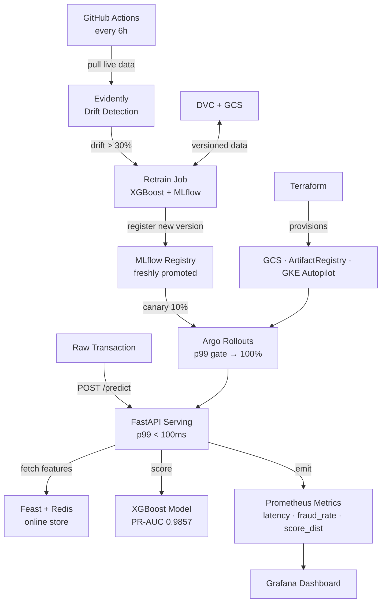

# FraudGuard — End-to-End MLOps Pipeline

> XGBoost fraud model that **retrains itself on drift**: train → register → serve → monitor → auto-retrain  
> Stack: MLflow · DVC · Feast · Redis · FastAPI · Evidently · Prometheus · Grafana · Argo Rollouts · Vertex AI · GCP

**Resume bullet:** *End-to-end MLOps pipeline (MLflow + Feast + BentoML + Evidently) serving fraud model at p99 <100ms; drift-triggered retraining cut model staleness from weeks → <24h.*

---

## Architecture



---

## Day-by-Day Build Summary

| Day | What was built | Key output |
|-----|---------------|-----------|
| 1 | XGBoost training, MLflow tracking, DVC pipeline, synthetic dataset | PR-AUC **0.9857** on test set |
| 2 | FastAPI serving, Prometheus metrics, Evidently drift detection, Feast+Redis, Grafana | Live `/predict` endpoint, drift flagged 6/10 features |
| 3 | Terraform GCP, Vertex AI Pipeline, Kind cluster, ArgoCD GitOps, Cloud Run deploy | Full K8s + GCP deploy pipeline |

---

## Project Structure

```
mlops-fraud-detection-platform/
├── src/
│   ├── train/
│   │   ├── generate_data.py      # synthetic 100k-row fraud dataset
│   │   └── train.py              # XGBoost + MLflow tracking
│   ├── serve/
│   │   ├── app.py                # FastAPI endpoint + Prometheus metrics
│   │   ├── bento_service.py      # BentoML service wrapper
│   │   └── load_and_predict.py   # end-to-end inference demo
│   ├── monitoring/
│   │   └── drift_detector.py     # Evidently drift detection
│   ├── features/
│   │   └── feature_repo/         # Feast entity + feature view definitions
│   └── pipelines/
│       └── vertex_pipeline.py    # Vertex AI KFP pipeline
├── infra/
│   ├── terraform/
│   │   ├── main.tf               # GCS, Artifact Registry, CI/CD SA
│   │   ├── gke.tf                # GKE Autopilot, VPC, Workload Identity
│   │   └── cloudrun.tf           # Cloud Run serving
│   ├── prometheus.yml            # scrape config
│   ├── prometheus-rules.yml      # SLO alert rules
│   └── grafana/                  # dashboards + datasource provisioning
├── helm/fraudguard/              # Helm chart with Argo Rollouts canary
├── k8s/
│   ├── manifests/                # namespace, RBAC, MLflow, Redis
│   └── argocd/                   # ArgoCD Application + App-of-Apps
├── .github/workflows/
│   ├── ci.yml                    # lint + test on push
│   └── retrain.yml               # drift → retrain → canary deploy
├── scripts/
│   ├── setup_local.ps1           # one-command local setup (Windows)
│   ├── setup_kind_cluster.ps1    # kind + Helm deploy
│   ├── gcp_deploy.ps1            # Terraform + Cloud Run one-shot
│   ├── promote_model.py          # MLflow alias promotion
│   └── feast_materialize.py      # Feast → Redis materialization
├── ADRs/                         # 3 architecture decision records
├── docker-compose.yml            # full local stack
├── dvc.yaml                      # generate → train → detect_drift
├── params.yaml                   # hyperparams, SLOs, drift threshold
└── kind-config.yaml              # local 3-node K8s cluster
```

---

## Quickstart — Full Local Stack

### Option A: One-command setup (Windows)
```powershell
.\scripts\setup_local.ps1
```

### Option B: Manual step-by-step

```bash
# 1. Install dependencies
pip install -r requirements.txt

# 2. Generate dataset
python src/train/generate_data.py

# 3. Start MLflow + Redis
docker compose up mlflow redis -d

# 4. Train model (wait for MLflow to be healthy first)
$env:MLFLOW_TRACKING_URI="http://localhost:5000"
python src/train/train.py

# 5. Promote to production
python scripts/promote_model.py --stage production

# 6. Start full stack (serving + Prometheus + Grafana)
docker compose up fraudguard-serve prometheus grafana -d

# 7. Test a prediction
curl -X POST http://localhost:8000/predict \
  -H "Content-Type: application/json" \
  -d '{
    "transaction_id":"demo_001","amount":9999,"hour_of_day":2,
    "day_of_week":6,"merchant_category":11,"distance_from_home_km":450,
    "velocity_1h":9,"velocity_24h":28,"avg_spend_7d":55,
    "is_international":1,"card_present":0
  }'
# Expected: {"decision":"BLOCK","fraud_probability":0.99xx}
```

---

## Demo — The Money Shot

### Drift → Retrain → Canary loop

```bash
# 1. Inject drifted data (already generated at data/raw/transactions_drifted.csv)
# 2. Run drift detection
python src/monitoring/drift_detector.py
# Output:
#   Drift detected: True
#   Drifted 6/10 features (60.0%)
#   Drifted features: ['amount', 'distance_from_home_km', 'hour_of_day',
#                      'is_international', 'velocity_1h', 'velocity_24h']
#   ACTION REQUIRED: Drift threshold exceeded - trigger retrain pipeline.
#   Exit code: 1  <-- GitHub Actions picks this up and fires retrain job

# 3. Manually trigger retrain
python src/train/train.py --run-name "post-drift-retrain"
python scripts/promote_model.py --stage production

# 4. New model serving with 10% canary (in K8s via Argo Rollouts)
kubectl argo rollouts get rollout fraudguard-serve -n fraudguard --watch
```

---

## Running Tests

```bash
pytest tests/ -v
# 10/10 passing:
#   test_generate_data_shape, test_fraud_rate, test_scale_pos_weight,
#   test_no_nulls, test_feature_ranges,
#   test_health, test_predict_allow, test_predict_block,
#   test_metrics_endpoint, test_invalid_payload
```

---

## DVC Pipeline

```bash
dvc repro              # run full pipeline
dvc dag                # visualise the pipeline graph
dvc params diff        # compare params across experiments
dvc metrics show       # show tracked metrics
```

Pipeline graph:
```
generate_data → train → detect_drift
```

---

## Kubernetes (Kind)

```powershell
# One-command local K8s deploy
.\scripts\setup_kind_cluster.ps1

# Check canary rollout
kubectl argo rollouts get rollout fraudguard-serve -n fraudguard
```

---

## GCP Deploy (one-shot screenshot)

```powershell
# Prerequisites: gcloud auth login, billing enabled on vizualflo-openclaw-prod
.\scripts\gcp_deploy.ps1

# Tear down to avoid charges
.\scripts\gcp_deploy.ps1 -Destroy
```

**Cost**: ~$0 for screenshot. Cloud Run scales to 0, GKE Autopilot billed per pod-second.

---

## Key Design Decisions

| Decision | Choice | Why |
|----------|--------|-----|
| Model | XGBoost | Best PR-AUC + retrainability on tabular fraud data |
| Class imbalance | `scale_pos_weight=99` | No SMOTE memory overhead, equivalent reweighting |
| Primary metric | PR-AUC | Accuracy is misleading at 1% fraud rate |
| Drift detection | Evidently feature drift (≥30%) | Labels arrive delayed by days; feature drift is the early signal |
| Feature store | Feast + Redis | <2ms online serving, no managed cost vs Vertex Feature Store |
| Model serving | FastAPI + MLflow | Loads alias `production` at startup, zero-downtime swap |
| Canary strategy | Argo Rollouts 10%→p99 gate→100% | Safe rollout with automatic rollback on SLO breach |
| Cloud serving | Cloud Run | Scales to 0 (≈$0), single command deploy, public URL for demo |

See [`ADRs/`](ADRs/) for full rationale on model choice, drift strategy, and feature store.

---

## API Reference

### `POST /predict`
```json
{
  "transaction_id": "txn_001",
  "amount": 9999.0,
  "hour_of_day": 2,
  "day_of_week": 6,
  "merchant_category": 11,
  "distance_from_home_km": 450.0,
  "velocity_1h": 9,
  "velocity_24h": 28,
  "avg_spend_7d": 55.0,
  "is_international": 1,
  "card_present": 0
}
```
Response:
```json
{
  "transaction_id": "txn_001",
  "fraud_probability": 0.9987,
  "decision": "BLOCK",
  "latency_ms": 6.2
}
```

### `GET /health`
```json
{"status": "ok", "model_loaded": true}
```

### `GET /metrics`
Prometheus-format metrics: `fraudguard_requests_total`, `fraudguard_request_latency_seconds`, `fraudguard_fraud_score`

---

## Production Gap (documented scope)

**In scope (portfolio demo):** Interview-defensible depth, fully working end-to-end.

**Out of scope (documented gap — reads as senior):**
- Multi-region HA
- Production-scale load/chaos testing
- Full pen-testing
- Ground-truth feedback loop (when fraud confirmed → retrain with real labels)
- Streaming inference (Kafka/Pub-Sub)
